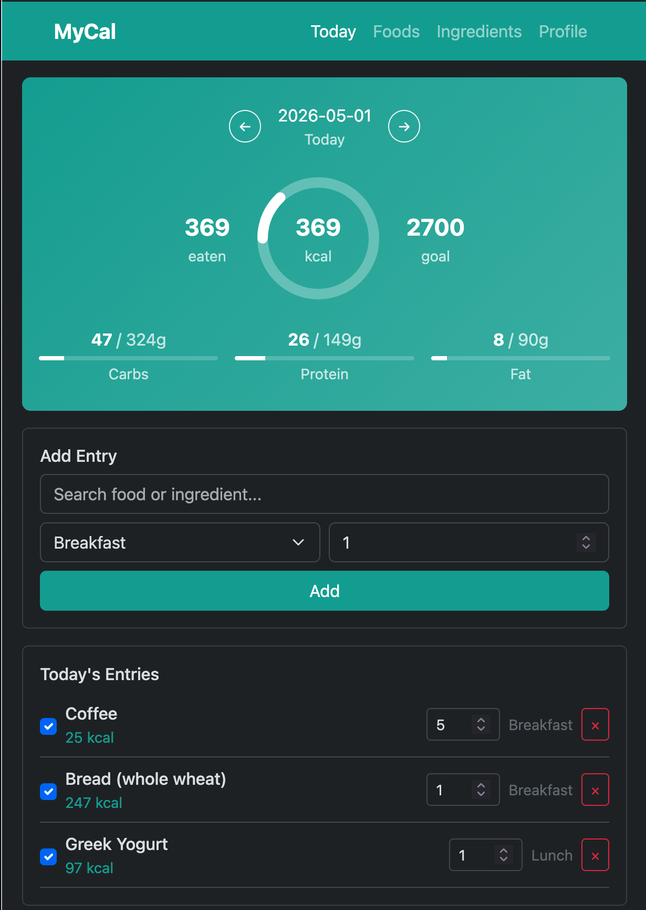

# MyCal

A simple, self-hosted calorie and macro tracking application built with Go.



## Features

- **Daily Tracking** - Log food entries by meal (breakfast, lunch, dinner, snack)
- **Ingredients & Foods** - Create base ingredients with nutritional info, combine them into foods/recipes
- **Macro Goals** - Set personal daily targets for calories, protein, carbs, and fat
- **Visual Dashboard** - Calorie ring and progress bars show daily progress at a glance
- **Fuzzy Search** - Find foods and ingredients quickly, even with typos
- **CSV Import** - Bulk import ingredients from CSV files
- **Mobile Friendly** - Responsive design with floating summary bar
- **Dark Mode** - Easy on the eyes

## Tech Stack

- **Backend**: Go with [Chi](https://github.com/go-chi/chi) router
- **Database**: SQLite (via [modernc.org/sqlite](https://pkg.go.dev/modernc.org/sqlite))
- **Frontend**: Bootstrap 5.3.3, [Fuse.js](https://fusejs.io/) for fuzzy search
- **No build step** - Pure HTML templates and vanilla JavaScript

## Quick Start

```bash
# Clone the repository
git clone https://github.com/mpdroog/mycal.git
cd mycal

# Build and run
make run

# Open in browser
open http://localhost:8080
```

## Configuration

```bash
# Custom port and data directory
./mycal -addr :3000 -data /path/to/data
```

| Flag | Default | Description |
|------|---------|-------------|
| `-addr` | `:8080` | HTTP listen address |
| `-data` | `./data` | Directory for SQLite database |

## Usage

### 1. Add Ingredients

Go to **Ingredients** and add base food items with nutritional values per 100g:

- Name (e.g., "Chicken Breast")
- Calories, Protein, Carbs, Fat
- Serving size (e.g., "100g")

A starter set of common ingredients is included in `data/ingredients.csv`. Import it via the Ingredients page.

### 2. Create Foods

Go to **Foods** to create recipes/meals by combining ingredients:

- Search and add ingredients
- Specify amounts in grams
- Totals are calculated automatically

### 3. Track Daily Intake

On the **Today** page:

- Search for a food or ingredient
- Select meal type and servings
- View your progress toward daily goals

### 4. Set Goals

Go to **Profile** to set your daily targets:

- Calories (kcal)
- Protein (g)
- Carbs (g)
- Fat (g)

## CSV Import Format

Import ingredients from CSV with these columns:

```csv
name,calories,protein,carbs,fat,serving_size
Chicken Breast,165,31,0,3.6,100g
Brown Rice,112,2.6,24,0.9,100g
```

## Project Structure

```
mycal/
├── main.go              # Application entry point and routes
├── db/db.go             # Database initialization and migrations
├── models/models.go     # Data structures
├── handlers/            # HTTP handlers
│   ├── entries.go       # Daily entry CRUD
│   ├── foods.go         # Foods/recipes CRUD
│   ├── ingredients.go   # Ingredients CRUD + CSV import
│   └── profile.go       # User profile/goals
├── templates/           # HTML templates (Go templates)
├── static/
│   ├── css/             # Bootstrap + custom styles
│   └── js/
│       ├── dashboard.js # Dashboard page logic
│       ├── food-form.js # Food form logic
│       ├── bootstrap.bundle.min.js
│       └── fuse.min.js  # Fuzzy search library
├── eslint.config.js     # ESLint configuration
├── package.json         # Node.js dependencies (dev only)
└── data/
    ├── mycal.db         # SQLite database (created on first run)
    └── ingredients.csv  # Starter ingredients for import
```

## Development

```bash
# Install JS dependencies (for linting)
npm install

# Run tests
make test

# Run Go linter
make lint

# Run JS linter (ESLint)
make lint-js

# Build binary
make build

# Run all checks (lint + lint-js + test)
make check

# Clean build artifacts
make clean
```

## License

MIT
